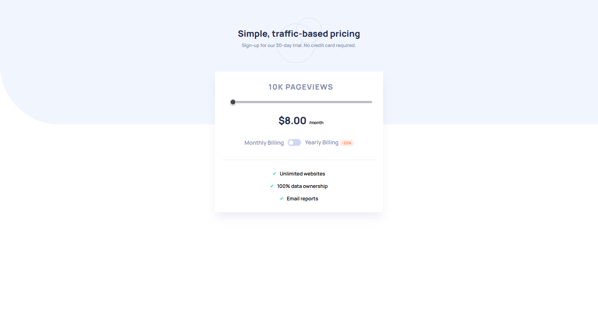

# Interactive Pricing Component



# Getting Started


1. First of all you need to clone app repository from github:

```
https://github.com/Lazzzare/Interactive-Pricing-Component-With-Svelte
```

2. Next step requires install all the dependencies.

```
npm install
```

3. Running the Project

```
npm run dev
```

# Links

- Solution URL: [GitHub Code](https://github.com/Lazzzare/Interactive-Pricing-Component-With-Svelte)
- Live Site URL: [Live Site](https://interactive-pricing-component-with-svelte.vercel.app/)

# Built With

- _Vite_
- _Svelte_
- _Typescript (TSX)_
- _TailwindCss_
